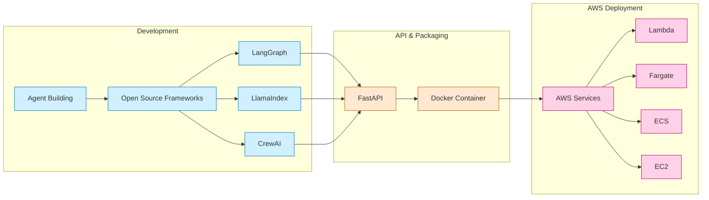

# Georgetown Course Finder AI Agent

This repository contains an AI agent for the Georgetown Course Finder, built with LangChain and deployed as an AWS Lambda function.

## System Architecture



## Installation

This project uses [uv](https://github.com/astral-sh/uv) for fast, reliable Python package management.

### Quick Setup (Recommended)

The easiest way to set up the project is to use the provided setup script:

```bash
# Clone the repository
git clone https://github.com/yourusername/gtown-course-finder.git
cd gtown-course-finder

# Run the setup script
python setup_venv.py
# Or if you're on Linux/Mac:
./setup_venv.py

# Activate the virtual environment
source .venv/bin/activate  # On Linux/Mac
# Or on Windows:
# .venv\Scripts\activate
```

This script will:
1. Install uv if it's not already installed
2. Create a virtual environment using uv
3. Install all dependencies from pyproject.toml

### Manual Setup

If you prefer to set up the project manually:

```bash
# Install uv if you haven't already
pip install uv

# Clone the repository
git clone https://github.com/yourusername/gtown-course-finder.git
cd gtown-course-finder

# Create and activate a virtual environment
uv venv
source .venv/bin/activate  # On Linux/Mac
# Or on Windows:
# .venv\Scripts\activate

# Install dependencies
uv pip install -e .

# For development dependencies
uv pip install -e ".[dev]"
```


## Setup LangSmith (Optional)
LangSmith will help us trace, monitor and debug LangChain applications.
You can sign up for LangSmith [here](https://smith.langchain.com/).
If you don't have access, you can skip this section

```shell
export LANGCHAIN_TRACING_V2=true
export LANGCHAIN_API_KEY=<your-api-key>
export LANGCHAIN_PROJECT=<your-project>  # if not specified, defaults to "default"
```

## Local Development

### Launch LangServe

```bash
langchain serve
```

## Running in Docker

This project folder includes a Dockerfile that allows you to easily build and host your LangServe app.

### Building the Image

To build the image, you simply:

```shell
docker build . -t gtown-course-finder
```

If you tag your image with something other than `gtown-course-finder`,
note it for use in the next step.

### Running the Image Locally

To run the image, you'll need to include any environment variables
necessary for your application.

In the below example, we inject the `TAVILY_API_KEY` environment
variable with the value set in my local environment
(`$TAVILY_API_KEY`)

We also expose port 8080 with the `-p 8080:8080` option.

```shell
docker run -e TAVILY_API_KEY=$TAVILY_API_KEY -p 8080:8080 gtown-course-finder
```

Note: AWS credentials for Bedrock access are automatically configured when running in AWS Lambda. For local development, ensure your AWS credentials are properly configured in your environment.

### Automated Build and Push

The repository includes a `build_and_push.sh` script that automates the build and push process to AWS ECR:

```bash
./build_and_push.sh
```

See `DEPLOY.md` for detailed deployment instructions.
