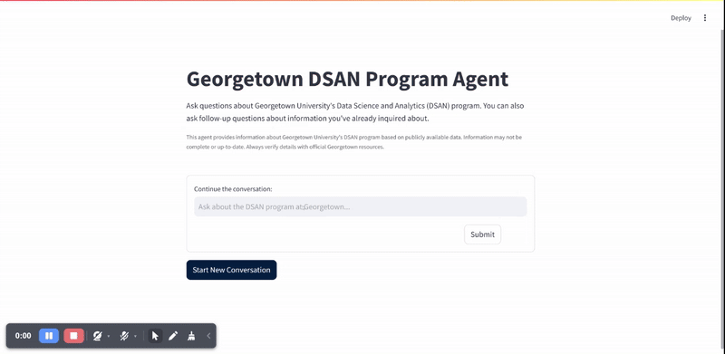
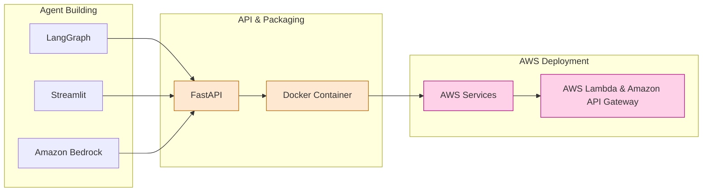
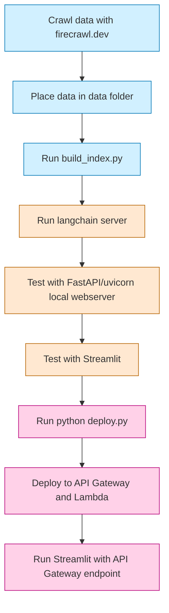

# FMBench Assistant

A LangGraph-based RAG (Retrieval-Augmented Generation) system for AWS Foundation Model Benchmarking Tool (FMBench). This repository showcases a design pattern for building and deploying LangGraph agents with a progression from local development to serverless deployment. The assistant helps users understand and work with FMBench - a Python package for running performance benchmarks for Foundation Models (FM) deployed on AWS Generative AI services.


We use the following tools and technologies:

1. Ingest the FMBench documentation data in a local [`FAISS`](https://python.langchain.com/docs/integrations/vectorstores/faiss/) index.
1. [Amazon Bedrock](https://aws.amazon.com/bedrock/) for LLMs, Amazon API gateway and AWS Lambda for hosting.
1. [LangGraph](https://www.langchain.com/langgraph) for Agents and LangChain for RAG.

## Demo video




## Architecture Overview



This project demonstrates a complete workflow for developing and deploying AI agents:

1. **Local Development**: Build and test the agent locally
2. **FastAPI Server**: Convert the agent to a FastAPI application
3. **Docker Containerization**: Package the application in a Docker container
4. **AWS Lambda Deployment**: Deploy the containerized application to AWS Lambda with API Gateway

## Components

- **RAG System**: Uses LangChain, FAISS, and AWS Bedrock to provide information about AWS Foundation Model Benchmarking Tool (FMBench)
- **LangGraph Agent**: ReAct agent pattern with tools for retrieving program information
- **Streamlit Frontend**: User-friendly chat interface for interacting with the agent
- **FastAPI Backend**: Serves the agent via HTTP endpoints
- **AWS Lambda Integration**: Serverless deployment with API Gateway

### Dev workflow


1. **Data Collection**:
   - Process FMBench documentation data and save as [`documents_1.json`](data/documents_1.json) in the `data` folder.
   - Place the processed data in the data folder

2. **Index Building**:
   - Run build_index.py to create the FAISS vector index

3. **Local Testing**:
   - Run the FastAPI server with `langchain serve`
   - Test the API endpoints with the local webserver
   - Test the user interface with Streamlit

4. **Deployment**:
   - Run python deploy.py to deploy to AWS Lambda and API Gateway
   - Test the deployed application by running Streamlit with the API Gateway endpoint





## Prerequisites

- Python 3.11+
- [uv](https://github.com/astral-sh/uv) for Python package management
- Docker (for containerization)
- AWS CLI configured with appropriate permissions
- AWS account with access to Bedrock and Lambda services

## Setup Instructions

### 1. Clone the Repository

```bash
git https://github.com/yourusername/fmbench-assistant
cd dsan-assistant
```

### 2. Environment Setup

Create a `.env` file in the project root with your AWS credentials and configuration:

```
AWS_ACCESS_KEY_ID=your_access_key
AWS_SECRET_ACCESS_KEY=your_secret_key
AWS_REGION=us-east-1
```

### 3. Install Dependencies with uv

This project uses `uv` for Python package management:

```bash
# Install uv if you don't have it
curl -LsSf https://astral.sh/uv/install.sh | sh
export PATH="$HOME/.local/bin:$PATH"

# Create a virtual environment and install dependencies
uv venv --python 3.11 && source .venv/bin/activate && uv pip install --requirement pyproject.toml
```

### 4. Build the Vector Index

Before running the application, you need to build the vector index from the source documents:

```bash
python build_index.py
```

This will create a FAISS index in the `indexes/fmbench_index` directory.

## Running Locally

### Run the FastAPI Server

```bash
langchain serve
```

### Run the Streamlit Frontend

```bash
streamlit run chatbot.py -- --api-server-url http://localhost:8000/generate
```

## Setup LangSmith (Optional)

LangSmith will help us trace, monitor and debug LangChain applications.
You can sign up for LangSmith [here](https://smith.langchain.com/).
If you don't have access, you can skip this section

```shell
export LANGCHAIN_TRACING_V2=true
export LANGCHAIN_API_KEY=<your-api-key>
export LANGCHAIN_PROJECT=<your-project>  # if not specified, defaults to "default"
```

## Deployment Process

### 1. Build and Push Docker Image

The repository includes a script to build and push the Docker image to Amazon ECR:

```bash
chmod +x build_and_push.sh
./build_and_push.sh
```

### 2. Deploy to AWS Lambda

Use the deployment script to create or update the Lambda function and API Gateway:

```bash
python deploy.py --function-name fmbench-assistant --role-arn YOUR_LAMBDA_ROLE_ARN --api-gateway
```

If you want to your Amazon Bedrock in a cross-account way i.e. the Lambda exists in say Account A but you want to use Amazon Bedrock in Account B then use the following command line

```bash
python deploy.py --function-name fmbench-assistant --role-arn YOUR_LAMBDA_ROLE_ARN  --bedrock-role-arn YOUR_ACCOUNT_B_BEDROCK_ROLE_ARN--api-gateway
```

The IAM role you need to use for the AWS Lambda needs to have Amazon Bedrock access (for example via [`AmazonBedrockFullAccess`](https://docs.aws.amazon.com/aws-managed-policy/latest/reference/AmazonBedrockFullAccess.html)) to use the models available via Amazon Bedrock and the models need to be enabled within your AWS account, see instructions available [here](https://docs.aws.amazon.com/bedrock/latest/userguide/model-access.html).

This will:
1. Create/update a Lambda function using the Docker image
2. Set up an API Gateway with appropriate routes
3. Configure permissions and API keys
4. Output the deployed API URL

### 3. Connect Streamlit to Deployed API

Once deployed, you can connect the Streamlit frontend to the deployed API:

```bash
streamlit run chatbot.py -- --api-server-url https://YOUR_API_ID.execute-api.us-east-1.amazonaws.com/prod/generate
```

## Project Structure

```
fmbench-assistant/
├── app/                      # FastAPI application
│   ├── __init__.py
│   └── server.py             # FastAPI server implementation
├── data/                     # Source data
│   └── documents_1.json      # FMBench documentation data
├── indexes/                  # Vector indexes
│   └── fmbench_index/        # FAISS index for FMBench data
├── .env                      # Environment variables (not in repo)
├── .gitignore                # Git ignore file
├── build_and_push.sh         # Script to build and push Docker image
├── build_index.py            # Script to build vector index
├── chatbot.py                # Streamlit frontend
├── deploy.py                 # AWS Lambda deployment script
├── Dockerfile                # Docker configuration
├── dsan_rag_setup.py         # RAG system setup
├── pyproject.toml            # Project configuration
├── README.md                 # Project documentation
└── requirements.txt          # Python dependencies
```

## Key Features

- **Conversation Memory**: Maintains chat history for contextual responses
- **Vector Search**: FAISS-based retrieval for efficient document search
- **AWS Bedrock Integration**: Leverages AWS's foundation models
- **Cross-Account Access**: Supports cross-account access to AWS Bedrock
- **Streamlit UI**: User-friendly interface with Georgetown branding

## License

[LICENCE](./LICENSE)

## Contributing

See [CONTRIBUTING.md](CONTRIBUTING.md) for contribution guidelines.
